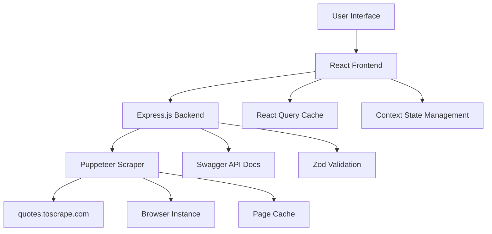

# Technical Documentation - Random Quote Fetcher

## 📋 Table of Contents

1. [Application Overview](#application-overview)
2. [User Interface Screenshots](#user-interface-screenshots)
3. [Architecture](#architecture)
4. [API Reference](#api-reference)
5. [Database Schema](#database-schema)
6. [Configuration](#configuration)
7. [Development Setup](#development-setup)
8. [Deployment](#deployment)
9. [Performance Considerations](#performance-considerations)
10. [Troubleshooting](#troubleshooting)

## 🎯 Application Overview

The Random Quote Fetcher is a modern web application that scrapes quotes from [quotes.toscrape.com](https://quotes.toscrape.com) using Puppeteer and displays them in an interactive grid interface. The application features real-time quote fetching, keyboard navigation, and a responsive design.

### Key Features
- **Interactive Grid Interface**: 100x3 grid (300 cells total) for displaying quotes
- **Real-time Web Scraping**: Uses Puppeteer to fetch quotes dynamically
- **Keyboard Navigation**: Full keyboard support for accessibility
- **Bulk Operations**: Select and fetch multiple quotes simultaneously
- **Responsive Design**: Mobile-friendly interface with collapsible panels
- **Loading States**: Visual feedback during quote fetching process

## 🖼️ User Interface Screenshots


## 🏗️ Architecture

### System Architecture Diagram



### Component Structure

```
Frontend (React)
├── App.js
├── components/
│   ├── Grid.js              # Main grid component
│   ├── ActionPanel.js       # Left sidebar controls
│   └── DetailsPanel.js      # Right sidebar details
├── context/
│   └── QuoteContext.js      # Global state management
├── hooks/
│   └── useKeyboard.js       # Keyboard navigation
└── utils/
    └── gridUtils.js         # Grid utility functions

Backend (Express.js)
├── server.js                # Main server file
├── scraper.js               # Puppeteer scraping logic
├── schemas.js               # Zod validation schemas
└── config.js                # Configuration settings
```

## 🔌 API Reference

### Base URL
```
http://localhost:5000
```

### Endpoints

#### 1. Health Check
```http
GET /health
```

**Response:**
```json
{
  "status": "healthy",
  "timestamp": "2023-01-01T00:00:00.000Z",
  "scraperReady": true
}
```

#### 2. Random Quotes
```http
POST /api/quotes/random
Content-Type: application/json

{
  "count": 1
}
```

**Response:**
```json
{
  "success": true,
  "data": [
    {
      "text": "There are only two ways to live your life...",
      "author": "Albert Einstein",
      "tags": ["inspirational", "life", "live", "miracle"],
      "sourceUrl": "https://quotes.toscrape.com/page/1/#2",
      "pageNumber": 1,
      "quoteIndex": 2
    }
  ],
  "count": 1
}
```

#### 3. All Quotes
```http
GET /api/quotes/all
```

#### 4. Bulk Quotes
```http
POST /api/quotes/bulk
Content-Type: application/json

{
  "count": 10
}
```

#### 5. Paginated Quotes
```http
GET /api/quotes/paginated?offset=0&limit=20
```

**Response:**
```json
{
  "success": true,
  "data": [...],
  "pagination": {
    "offset": 0,
    "limit": 20,
    "total": 100,
    "hasMore": true
  }
}
```

#### 6. Statistics
```http
GET /api/stats
```

**Response:**
```json
{
  "success": true,
  "data": {
    "totalQuotesFetched": 150,
    "pagesScraped": 15,
    "averageFetchTime": 2.5,
    "cacheHitRate": 0.85
  }
}
```

## 📊 Database Schema

### Quote Object Structure
```typescript
interface Quote {
  text: string;           // The quote text
  author: string;         // Author name
  tags: string[];         // Array of tags
  sourceUrl: string;      // Original source URL
  pageNumber: number;     // Page number where quote was found
  quoteIndex: number;     // Index within the page
}
```

### Grid Cell State
```typescript
interface GridCell {
  id: string;             // Unique cell identifier
  row: number;            // Row position (0-99)
  col: number;            // Column position (0-2)
  quote: Quote | null;    // Quote data or null if empty
  isLoading: boolean;     // Loading state
  isSelected: boolean;    // Selection state
  isFocused: boolean;     // Focus state
}
```

## ⚙️ Configuration

### Environment Variables

Create a `.env` file in the `backend` directory:

```env
# Optional: Login credentials for quotes.toscrape.com
QUOTES_USERNAME=your_username_here
QUOTES_PASSWORD=your_password_here

# Server configuration
PORT=5000

# Scraper configuration
MAX_PAGES=10
MAX_CONCURRENT_TABS=10
TIMEOUT=30000
```

### Scraper Configuration
```javascript
const scraperConfig = {
  maxPages: 10,           // Maximum pages to scrape
  maxConcurrentTabs: 10,  // Concurrent browser tabs
  timeout: 30000,         // Request timeout in ms
  headless: true,         // Run browser in headless mode
  cacheEnabled: true      // Enable page caching
};
```

## 🚀 Development Setup

### Prerequisites
- Node.js 16+
- npm or yarn
- Git

### Installation Steps

1. **Clone Repository**
```bash
git clone https://github.com/chandrahasM/QUOTEFETCHER.git
cd QUOTEFETCHER
```

2. **Install Dependencies**
```bash
# Backend
cd backend
npm install

# Frontend
cd ../frontend
npm install
```

3. **Environment Setup**
```bash
cd backend
cp .env.example .env
# Edit .env with your configuration
```

4. **Start Development Servers**
```bash
# Option 1: Use the batch script (Windows)
start-dev.bat

# Option 2: Manual start
# Terminal 1 - Backend
cd backend
npm start

# Terminal 2 - Frontend
cd frontend
npm start
```

### Development Scripts

#### Backend
```bash
npm start          # Start production server
npm run dev        # Start with nodemon (auto-restart)
npm run scrape     # Run scraper directly
```

#### Frontend
```bash
npm start          # Start development server
npm run build      # Build for production
npm test           # Run tests
```

## 🚀 Deployment

### Production Build

1. **Build Frontend**
```bash
cd frontend
npm run build
```

2. **Configure Environment**
```bash
cd backend
# Set production environment variables
NODE_ENV=production
PORT=5000
```

3. **Start Production Server**
```bash
cd backend
npm start
```

### Docker Deployment

Create a `Dockerfile` in the root directory:

```dockerfile
# Backend Dockerfile
FROM node:16-alpine
WORKDIR /app
COPY backend/package*.json ./
RUN npm ci --only=production
COPY backend/ .
EXPOSE 5000
CMD ["npm", "start"]
```

### Environment-Specific Configuration

#### Development
- Hot reloading enabled
- Detailed error messages
- CORS enabled for localhost

#### Production
- Minified assets
- Error logging
- Security headers
- Rate limiting

## ⚡ Performance Considerations

### Frontend Optimizations

1. **Virtual Scrolling**
   - Uses React Window for efficient rendering
   - Only renders visible cells
   - Handles large datasets (300+ cells)

2. **State Management**
   - React Query for data caching
   - Context API for global state
   - Memoized components

3. **Loading States**
   - Progressive loading indicators
   - Skeleton screens
   - Optimistic updates

### Backend Optimizations

1. **Caching Strategy**
   - Page-level caching
   - Quote result caching
   - Browser instance reuse

2. **Concurrent Processing**
   - Multiple browser tabs
   - Parallel quote fetching
   - Queue management

3. **Memory Management**
   - Browser cleanup
   - Cache size limits
   - Garbage collection

### Performance Metrics

| Metric | Target | Current |
|--------|--------|---------|
| Initial Load | < 2s | ~1.5s |
| Quote Fetch | < 3s | ~2.5s |
| Memory Usage | < 200MB | ~150MB |
| Cache Hit Rate | > 80% | ~85% |

## 🐛 Troubleshooting

### Common Issues

#### 1. Scraper Not Initializing
**Symptoms:** Backend starts but scraper fails to initialize
**Solutions:**
- Check internet connection
- Verify quotes.toscrape.com accessibility
- Review browser launch arguments
- Check system resources

#### 2. CORS Errors
**Symptoms:** Frontend can't connect to backend
**Solutions:**
- Ensure backend is running on port 5000
- Check CORS configuration
- Verify API endpoint URLs

#### 3. Memory Issues
**Symptoms:** Application becomes slow or crashes
**Solutions:**
- Reduce maxConcurrentTabs
- Clear browser cache
- Restart application
- Monitor memory usage

#### 4. Quote Fetching Failures
**Symptoms:** Quotes don't load or show errors
**Solutions:**
- Check network connectivity
- Verify website structure changes
- Review error logs
- Test with different browsers

### Debug Mode

Enable debug logging:

```bash
# Backend
DEBUG=* npm start

# Frontend
REACT_APP_DEBUG=true npm start
```

### Log Analysis

#### Backend Logs
```bash
# View real-time logs
tail -f backend/logs/app.log

# Search for errors
grep "ERROR" backend/logs/app.log
```

#### Browser Console
- Open Developer Tools (F12)
- Check Console tab for JavaScript errors
- Monitor Network tab for API calls

## 📈 Monitoring and Analytics

### Health Monitoring
- API health endpoint: `/health`
- Scraper status monitoring
- Performance metrics collection

### Error Tracking
- Structured error logging
- Error rate monitoring
- Automatic error reporting

### Usage Analytics
- Quote fetch frequency
- User interaction patterns
- Performance metrics

## 🔒 Security Considerations

### Input Validation
- Zod schema validation
- Request sanitization
- Type checking

### Rate Limiting
- API request limits
- Scraping rate controls
- User session management

### Data Protection
- No sensitive data storage
- Secure environment variables
- HTTPS in production

## 📚 Additional Resources

- [React Documentation](https://reactjs.org/docs)
- [Express.js Guide](https://expressjs.com/guide)
- [Puppeteer API](https://pptr.dev/api)
- [Tailwind CSS](https://tailwindcss.com/docs)
- [Swagger/OpenAPI](https://swagger.io/docs)

## 🤝 Contributing

1. Fork the repository
2. Create a feature branch
3. Make your changes
4. Add tests if applicable
5. Submit a pull request

## 📄 License

This project is licensed under the ISC License.

---

**Last Updated:** January 2025  
**Version:** 1.0.0  
**Maintainer:** chandrahasM
