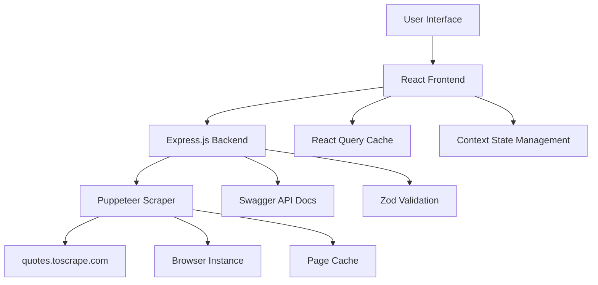

# Technical Documentation - Random Quote Fetcher

## 📋 Table of Contents

1. [Application Overview](#application-overview)
2. [User Interface Screenshots](#user-interface-screenshots)
3. [Architecture](#architecture)

## 🎯 Application Overview

The Random Quote Fetcher is a modern web application that scrapes quotes from [quotes.toscrape.com](https://quotes.toscrape.com) using Puppeteer and displays them in an interactive grid interface. The application features real-time quote fetching, keyboard navigation, and a responsive design.

### Key Features
- **Interactive Grid Interface**: 100x3 grid (300 cells total) for displaying quotes
- **Real-time Web Scraping**: Uses Puppeteer to fetch quotes dynamically
- **Keyboard Navigation**: Full keyboard support for accessibility
- **Bulk Operations**: Select and fetch multiple quotes simultaneously
- **Responsive Design**: Mobile-friendly interface with collapsible panels
- **Loading States**: Visual feedback during quote fetching process

## 🖼️ User Interface Screenshots


## 🏗️ Architecture

### System Architecture Diagram



### Component Structure

```
Frontend (React)
├── App.js
├── components/
│   ├── Grid.js              # Main grid component
│   ├── ActionPanel.js       # Left sidebar controls
│   └── DetailsPanel.js      # Right sidebar details
├── context/
│   └── QuoteContext.js      # Global state management
├── hooks/
│   └── useKeyboard.js       # Keyboard navigation
└── utils/
    └── gridUtils.js         # Grid utility functions

Backend (Express.js)
├── server.js                # Main server file
├── scraper.js               # Puppeteer scraping logic
├── schemas.js               # Zod validation schemas
└── config.js                # Configuration settings
```

