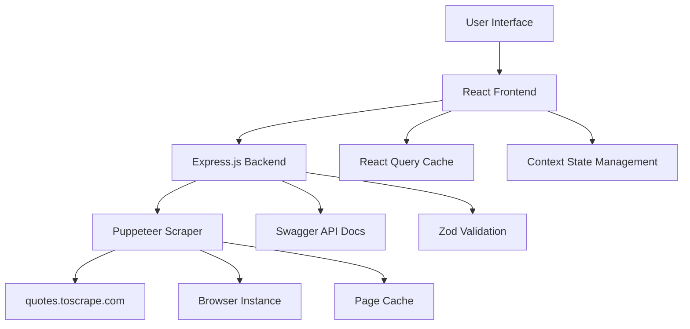

# Technical Documentation - Random Quote Fetcher

## 📋 Table of Contents

1. [Application Overview](#application-overview)
2. [User Interface Screenshots](#user-interface-screenshots)
3. [Architecture](#architecture)
4. [Performance Engineering Enhancements](#performance-engineering-enhancements)
5. [System Design Improvements](#system-design-improvements)
6. [Frontend Scalability Solutions](#frontend-scalability-solutions)
7. [Production Readiness Features](#production-readiness-features)

## 🎯 Application Overview

The Random Quote Fetcher is a modern web application that scrapes quotes from [quotes.toscrape.com](https://quotes.toscrape.com) using Puppeteer and displays them in an interactive grid interface. The application features real-time quote fetching, keyboard navigation, and a responsive design.

### Key Features
- **Interactive Grid Interface**: 100x3 grid (300 cells total) for displaying quotes
- **Real-time Web Scraping**: Uses Puppeteer to fetch quotes dynamically
- **Keyboard Navigation**: Full keyboard support for accessibility
- **Bulk Operations**: Select and fetch multiple quotes simultaneously
- **Responsive Design**: Mobile-friendly interface with collapsible panels
- **Loading States**: Visual feedback during quote fetching process

## 🖼️ User Interface Screenshots


## 🏗️ Architecture

### System Architecture Diagram



### Component Structure

```
Frontend (React)
├── App.js
├── components/
│   ├── Grid.js              # Main grid component
│   ├── ActionPanel.js       # Left sidebar controls
│   └── DetailsPanel.js      # Right sidebar details
├── context/
│   └── QuoteContext.js      # Global state management
├── hooks/
│   └── useKeyboard.js       # Keyboard navigation
└── utils/
    └── gridUtils.js         # Grid utility functions

Backend (Express.js)
├── server.js                # Main server file
├── scraper.js               # Puppeteer scraping logic
├── schemas.js               # Zod validation schemas
└── config.js                # Configuration settings
```

## 🚀 Performance Engineering Enhancements

### Current Limitations for 10k-100k Records

**❌ Performance Engineering Issues:**
- **Concurrent Operations**: Limited to 10 concurrent Puppeteer tabs (hardcoded)
- **Memory Management**: No virtual scrolling implementation for large datasets
- **DOM Updates**: Renders all 300 cells simultaneously without virtualization
- **Bulk Operations**: Maximum 300 quotes per request (schema limitation)

**❌ System Design Issues:**
- **No Request Queuing**: No throttling or queuing mechanism
- **Limited Caching**: Only basic page-level caching, no Redis/memory optimization
- **No Error Recovery**: Basic try-catch without retry mechanisms
- **Single Browser Instance**: All operations share one Puppeteer browser

**❌ Frontend Scalability Issues:**
- **No Virtual Scrolling**: All 300 cells rendered in DOM
- **State Management**: Context-based state not optimized for large datasets
- **No Lazy Loading**: All cells loaded immediately

### Recommended Solutions

#### 1. Concurrent Operations (300+ concurrent)

**Connection Pooling with Multiple Puppeteer Instances:**
```javascript
// Enhanced scraper configuration
const ScrapingConfigSchema = z.object({
  maxPages: z.number().int().min(1).max(100).default(100),
  maxConcurrentTabs: z.number().int().min(1).max(300).default(300),
  browserPoolSize: z.number().int().min(1).max(10).default(5),
  timeout: z.number().int().min(1000).default(30000)
});
```

**Request Batching with Configurable Concurrency:**
- Implement worker threads for CPU-intensive operations
- Use cluster mode for Node.js backend scaling
- Add configurable concurrency limits per operation type
- Implement request prioritization and queuing

#### 2. Memory Management

**Virtual Scrolling Implementation:**
```javascript
// Using react-window for virtual scrolling
import { FixedSizeGrid as Grid } from 'react-window';

const VirtualizedGrid = ({ items, width, height }) => (
  <Grid
    columnCount={3}
    columnWidth={width / 3}
    height={height}
    rowCount={Math.ceil(items.length / 3)}
    rowHeight={80}
    width={width}
  >
    {({ columnIndex, rowIndex, style }) => (
      <div style={style}>
        <Cell 
          data={items[rowIndex * 3 + columnIndex]} 
          index={rowIndex * 3 + columnIndex}
        />
      </div>
    )}
  </Grid>
);
```

**Pagination with Lazy Loading:**
- Implement database-backed pagination
- Use intersection observer for viewport-based loading
- Add memory monitoring and garbage collection optimization
- Implement data streaming for real-time updates

#### 3. Efficient DOM Updates

**Virtualized Grid Rendering:**
- Only render visible cells in viewport
- Implement cell-level memoization with `React.memo`
- Use `useCallback` and `useMemo` for expensive operations
- Add intersection observer for viewport-based rendering

**Performance Optimizations:**
```javascript
// Memoized cell component
const Cell = React.memo(({ data, index }) => {
  const { state, dispatch } = useQuote();
  const cellId = getCellId(data.row, data.col);
  
  // Memoized calculations
  const cellClasses = useMemo(() => 
    calculateCellClasses(data, state), [data, state]
  );
  
  return (
    <div className={cellClasses} onClick={handleClick}>
      {data.content}
    </div>
  );
});
```

## 🔧 System Design Improvements

### Request Queuing & Throttling

**Redis-based Job Queue (Bull/BullMQ):**
```javascript
// Job queue implementation
const Queue = require('bull');
const quoteQueue = new Queue('quote processing', {
  redis: { host: 'localhost', port: 6379 }
});

// Rate limiting with sliding window
const rateLimiter = new RateLimiter({
  windowMs: 60000, // 1 minute
  max: 1000, // 1000 requests per window
  standardHeaders: true,
  legacyHeaders: false,
});
```

**Circuit Breaker Pattern:**
```javascript
// Circuit breaker for external API calls
const circuitBreaker = new CircuitBreaker(fetchQuote, {
  timeout: 3000,
  errorThresholdPercentage: 50,
  resetTimeout: 30000
});
```

### Caching Strategies

**Multi-layer Caching:**
- **L1 Cache**: In-memory cache for frequently accessed data
- **L2 Cache**: Redis cache for distributed caching
- **L3 Cache**: Database query result caching
- **CDN Cache**: Static asset caching

**Cache Implementation:**
```javascript
// Multi-layer cache implementation
const cache = {
  memory: new Map(),
  redis: new Redis(process.env.REDIS_URL),
  
  async get(key) {
    // Try memory cache first
    if (this.memory.has(key)) {
      return this.memory.get(key);
    }
    
    // Try Redis cache
    const redisValue = await this.redis.get(key);
    if (redisValue) {
      const parsed = JSON.parse(redisValue);
      this.memory.set(key, parsed);
      return parsed;
    }
    
    return null;
  }
};
```

### Error Recovery Patterns

**Exponential Backoff Retry Logic:**
```javascript
// Retry mechanism with exponential backoff
const retryWithBackoff = async (fn, maxRetries = 3) => {
  for (let i = 0; i < maxRetries; i++) {
    try {
      return await fn();
    } catch (error) {
      if (i === maxRetries - 1) throw error;
      
      const delay = Math.pow(2, i) * 1000; // 1s, 2s, 4s
      await new Promise(resolve => setTimeout(resolve, delay));
    }
  }
};
```

**Circuit Breaker for External Dependencies:**
- Implement health checks and auto-recovery
- Add graceful degradation strategies
- Monitor external service availability
- Implement fallback mechanisms

## 🎨 Frontend Scalability Solutions

### State Management at Scale

**Migration to Redux Toolkit:**
```javascript
// Redux store configuration
import { configureStore } from '@reduxjs/toolkit';
import { quoteSlice } from './slices/quoteSlice';

export const store = configureStore({
  reducer: {
    quotes: quoteSlice.reducer,
  },
  middleware: (getDefaultMiddleware) =>
    getDefaultMiddleware({
      serializableCheck: {
        ignoredActions: ['quotes/updateQuote'],
      },
    }),
});
```

**State Normalization:**
```javascript
// Normalized state structure
const normalizedState = {
  entities: {
    quotes: {
      '1': { id: '1', text: '...', author: '...' },
      '2': { id: '2', text: '...', author: '...' }
    },
    cells: {
      '0-0': { id: '0-0', quoteId: '1', isLoading: false },
      '0-1': { id: '0-1', quoteId: '2', isLoading: false }
    }
  },
  ui: {
    focusedCell: '0-0',
    selectedCells: ['0-0', '0-1']
  }
};
```

### Virtual Scrolling Implementation

**React Window Integration:**
```javascript
// Virtual scrolling grid component
import { FixedSizeGrid as Grid } from 'react-window';
import { useMemo } from 'react';

const VirtualizedQuoteGrid = ({ quotes, onCellClick }) => {
  const itemData = useMemo(() => ({
    quotes,
    onCellClick
  }), [quotes, onCellClick]);

  return (
    <Grid
      columnCount={3}
      columnWidth={300}
      height={600}
      rowCount={Math.ceil(quotes.length / 3)}
      rowHeight={80}
      width={900}
      itemData={itemData}
    >
      {CellRenderer}
    </Grid>
  );
};
```

### Lazy Loading Strategy

**Intersection Observer Implementation:**
```javascript
// Lazy loading hook
const useLazyLoading = (threshold = 0.1) => {
  const [isVisible, setIsVisible] = useState(false);
  const ref = useRef();

  useEffect(() => {
    const observer = new IntersectionObserver(
      ([entry]) => {
        if (entry.isIntersecting) {
          setIsVisible(true);
          observer.disconnect();
        }
      },
      { threshold }
    );

    if (ref.current) {
      observer.observe(ref.current);
    }

    return () => observer.disconnect();
  }, [threshold]);

  return [ref, isVisible];
};
```

## 🛡️ Production Readiness Features

### Error Boundaries

**Component-level Error Boundaries:**
```javascript
// Error boundary component
class QuoteErrorBoundary extends React.Component {
  constructor(props) {
    super(props);
    this.state = { hasError: false, error: null };
  }

  static getDerivedStateFromError(error) {
    return { hasError: true, error };
  }

  componentDidCatch(error, errorInfo) {
    console.error('Quote Error:', error, errorInfo);
    // Send to error reporting service
  }

  render() {
    if (this.state.hasError) {
      return <ErrorFallback error={this.state.error} />;
    }

    return this.props.children;
  }
}
```

### Loading States

**Skeleton Loading Implementation:**
```javascript
// Skeleton loading component
const SkeletonCell = () => (
  <div className="animate-pulse">
    <div className="h-4 bg-gray-200 rounded w-3/4 mb-2"></div>
    <div className="h-3 bg-gray-200 rounded w-1/2"></div>
  </div>
);
```

### Monitoring & Observability

**Performance Monitoring:**
```javascript
// Performance monitoring
const performanceMonitor = {
  measureRender: (componentName, renderFn) => {
    const start = performance.now();
    const result = renderFn();
    const end = performance.now();
    
    console.log(`${componentName} render time: ${end - start}ms`);
    return result;
  }
};
```

### Configuration Updates

**Enhanced Configuration Schema:**
```javascript
// Updated configuration for scalability
const ScrapingConfigSchema = z.object({
  maxPages: z.number().int().min(1).max(1000).default(100),
  maxConcurrentTabs: z.number().int().min(1).max(500).default(300),
  browserPoolSize: z.number().int().min(1).max(20).default(5),
  timeout: z.number().int().min(1000).default(30000),
  retryAttempts: z.number().int().min(0).max(5).default(3),
  cacheTTL: z.number().int().min(60).default(3600)
});
```

**Bulk Operations Enhancement:**
```javascript
// Updated bulk request schema
const BulkQuoteRequestSchema = z.object({
  count: z.number().int().min(1).max(10000, "Maximum 10,000 quotes per request"),
  priority: z.enum(['low', 'normal', 'high']).default('normal'),
  batchSize: z.number().int().min(1).max(1000).default(100)
});
```

This comprehensive enhancement plan addresses all the identified performance bottlenecks and provides a clear roadmap for scaling the application to handle 10k-100k records efficiently.

